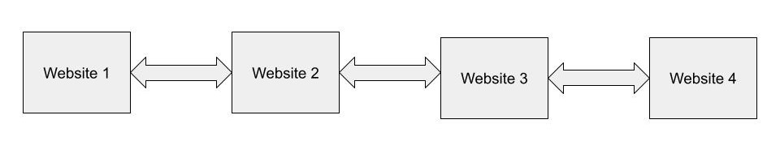

# Linked Lists in C#

## Definition
A linked list is a linear collection of data elements whose order is not given by their physical placement in memory. Instead, each element points to the next. It is a data structure consisting of a collection of nodes which together represent a sequence.


## Common examples of Linked Lists
* Previous and next page in a web browser
* Spotify / Apple music in queue

## Efficiency of Linked Lists
The efficiency of Linked Lists are O(n)

## Terms
|      | <font size="4">Definitions</font>                                                        |
|------|------------------------------------------------------------------------------------------|
| Head | The head refers to the first Node in the linked list                                     |
| Tail | The Tail refers to the last node in the linked list                                      |
| Node | A node is a data set in which the node contains the data, next, and previous information |
| Next | The next information refers the the next node in the linked list                         |
| Prev | The previous information refers to the previous node in the linked list                  |
| Data | The data refers to the information being stored in the node                              |

## Linked Lists operations


| <font size="4">Constructors</font>                 | <font size="4">Usage</font>                                                                                                                                                                  |
|----------------------------------------------------|----------------------------------------------------------------------------------------------------------------------------------------------------------------------------------------------|
| LinkedList<T>()                                    | Initializes a new instance of the LinkedList<T> class that is empty.                                                                                                                         |
| LinkedList<T>(IEnumerable<T>)                      | Initializes a new instance of the LinkedList<T> class that contains elements copied from the specified IEnumerable and has sufficient capacity to accommodate the number of elements copied. |
| LinkedList<T>(SerializationInfo, StreamingContext) | Initializes a new instance of the LinkedList<T> class that is serializable with the specified SerializationInfo and StreamingContext.                                                        |


| <font size="4">Properties</font> | <font size="4">Usage</font>                                       |
|----------------------------------|-------------------------------------------------------------------|
| Count                            | Gets the number of nodes actually contained in the LinkedList<T>. |
| First                            | Gets the first node of the LinkedList<T>.                         |
| Last                             | Gets the last node of the LinkedList<T>.                          |


| <font size="4">Methods</font>                      | <font size="4">Usage</font>                                                                                                 |
|----------------------------------------------------|-----------------------------------------------------------------------------------------------------------------------------|
| AddAfter(LinkedListNode<T>, LinkedListNode<T>)     | Adds the specified new node after the specified existing node in the LinkedList<T>.                                         |
| AddAfter(LinkedListNode<T>, T)                     | Adds a new node containing the specified value after the specified existing node in the LinkedList<T>.                      |
| AddBefore(LinkedListNode<T>, LinkedListNode<T>)    | Adds the specified new node before the specified existing node in the LinkedList<T>.                                        |
 | AddBefore(LinkedListNode<T>, T)                    | Adds a new node containing the specified value before the specified existing node in the LinkedList<T>.                     |
| AddFirst(LinkedListNode<T>)                        | Adds the specified new node at the start of the LinkedList<T>.                                                              |
| AddFirst(T)                                        | Adds a new node containing the specified value at the start of the LinkedList<T>.                                           |
| AddLast(LinkedListNode<T>)                         | Adds the specified new node at the end of the LinkedList<T>.                                                                |
| AddLast(T)                                         | Adds a new node containing the specified value at the end of the LinkedList<T>.                                             |
| Clear()                                            | Removes all nodes from the LinkedList<T>.                                                                                   |
| Contains(T)                                        | Determines whether a value is in the LinkedList<T>.                                                                         |
| CopyTo(T[], Int32)                                 | Copies the entire LinkedList<T> to a compatible one-dimensional Array, starting at the specified index of the target array. |
| Equals(Object)                                     | Determines whether the specified object is equal to the current object. (Inherited from Object)                             |
| Find(T)                                            | Finds the first node that contains the specified value.                                                                     |
| FindLast(T)                                        | Finds the last node that contains the specified value.                                                                      |
| GetEnumerator()                                    | Returns an enumerator that iterates through the LinkedList<T>.                                                              |
| GetHashCode()                                      | Serves as the default hash function. (Inherited from Object)                                                                |
| GetObjectData(SerializationInfo, StreamingContext) | Implements the ISerializable interface and returns the data needed to serialize the LinkedList<T> instance.                 |
| GetType()                                          | Gets the Type of the current instance. (Inherited from Object)                                                              |
| MemberwiseClone()                                  | Creates a shallow copy of the current Object. (Inherited from Object)                                                       |
| OnDeserialization(Object)                          | Implements the ISerializable interface and raises the deserialization event when the deserialization is complete.           |
| Remove(LinkedListNode<T>)                          | Removes the specified node from the LinkedList<T>.                                                                          |
| Remove(T)                                          | Removes the first occurrence of the specified value from the LinkedList<T>.                                                 |
| RemoveFirst()                                      | Removes the node at the start of the LinkedList<T>.                                                                         |
| RemoveLast()                                       | Removes the node at the end of the LinkedList<T>.                                                                           |
| ToString()                                         | Returns a string that represents the current object. (Inherited from Object                                                 |


## Linked Lists Example: Music Queue
Spotify and Apple music use linked lists to keep track of what a user has listened to and what they have queued. Through this we are able to traverse through songs we just listened to and songs that we have queued for us. Below is an example of how a linked list might look for this.

> #### <a href="https://github.com/BYUI-CSE212-W23-01/final-project-atk21009/tree/main/C%23%20Files/Examples/LinkedListExample">Project Link</a>

### Linked List
```csharp
public class LinkedList: IEnumerable<string>
{
    private Node? _head;
    private Node? _tail;

    public void InsertTail(string song)
    {
        Node newNode = new Node(song);
        if (_head is null)
        {
            _head = newNode;
            _tail = newNode;
        }
        else
        {
            newNode.Prev = _tail;
            _tail!.Next = newNode;
            _tail = newNode;
        }
    }
    
    public void InsertAfter(string song, string newSong)
    {
        Node? curr = _head;
        while (curr is not null)
        {
            if (curr.Song == song)
            {
                if (curr == _tail)
                {
                    InsertTail(newSong);
                }
                else
                {
                    Node newNode = new Node(newSong);
                    newNode.Prev = curr;
                    newNode.Next = curr.Next;
                    curr.Next!.Prev = newNode;
                    curr.Next = newNode;
                }
                return;
            }
            curr = curr.Next;
        }
    }

    public IEnumerator<string> GetEnumerator()
    {
        var curr = _head;
        while (curr is not null)
        {
            yield return curr.Song;
            curr = curr.Next;
        }
    }

    IEnumerator IEnumerable.GetEnumerator()
    {
        return this.GetEnumerator();
    }
    
    public override string ToString() {
        return "<LinkedList>{" + string.Join(", ", this) + "}";
    }
}
```

### LinkedListTester
```csharp
public static class LinkedListTester
{
    public static void Run()
    {
        var ll = new LinkedList();
        ll.InsertTail("Baby");
        ll.InsertTail("We Are Young");
        ll.InsertTail("Dancing Queen");
        ll.InsertTail("My House");
        
        Console.WriteLine(ll.ToString()); // <LinkedList>{Baby, We Are Young, Dancing Queen, My House}
        
        ll.InsertAfter("We Are Young", "Riptide");
        ll.InsertAfter("Dancing Queen", "Little Talks");
        
        Console.WriteLine(ll.ToString()); // <LinkedList>{Baby, We Are Young, Riptide, Dancing Queen, Little Talks, My House}
    } 
    
}
```
### Node
```csharp
public class Node 
{
    public string Song { get; set; }
    public Node? Next { get; set; }
    public Node? Prev { get; set; }

    public Node(string song)
    {
        this.Song = song;
    }
}
```

### Output

    <LinkedList>{Baby, We Are Young, Dancing Queen, My House}
    <LinkedList>{Baby, We Are Young, Riptide, Dancing Queen, Little Talks, My House}


## Linked List Problem: Search History
Now try it for yourself. Below is a problem in which animal names are added to a linked list. Using your knowledge of linked lists and additional resources try to solve the problems below.

### Problem Description
This project is a representative of internet search history. In which we are able to traverse forwards and backwards on our list to visit different sites. We use various methods to add, remove, clear, etc to our linked list. We are able to represent our search history with linked lists and traverse through our search history.


> Above is an image how the first 4 websites should look like when entered. The websites should point to one another so that the user can traverse forward and backwards between their website history.


> #### <a href="https://github.com/BYUI-CSE212-W23-01/final-project-atk21009/tree/main/C%23%20Files/ProblemTemplates/LinkedListProblemTemplate">Problem Template</a>

> #### <a href="https://github.com/BYUI-CSE212-W23-01/final-project-atk21009/tree/main/C%23%20Files/Problems/LinkedListProblem">Problem Solution Link</a>


## Additional Info
For additional information about Linked Lists, and different examples check out <a href="https://learn.microsoft.com/en-us/dotnet/api/system.collections.generic.linkedlist-1?view=net-7.0">Microsoft Learn</a>. In which they go into more depth, and give additional examples.
