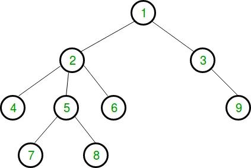

# Trees in C#

## Definition
A tree-like data structure or branched data structure consists of set of elements (nodes) which could be linked to other elements, sometimes hierarchically, sometimes not. Trees represent hierarchies, while graphs represent more general relations such as the map of city.


| <font size="4">Terms</font> | <font size="4">Definition</font>                        |
|-----------------------------|---------------------------------------------------------|
| Root Node                   | The root node refers to the first node in the set       |
| Key                         | Value contained inside a Node                           |
| Parent Node                 | Refers to Node above child Node                         |
| Leaf Node / Child Node      | Refers to Node below a parent Node                      |
| Levels                      | Refers to the depth of a tree                           |
| Siblings                    | Refers to nodes on same level and same side of tree     |
| Sub-Tree                    | Refers to a branch of a parent node and child node pair |

## Trees types
### General Tree
> General tree when there is no constraint imposed on the hierarchy of the tree. In General Tree, each node can have infinite number of children. This tree is the super-set of all other types of trees.


### Binary Tree
> Binary tree is the type of tree in which each parent can have at most two children. The children are referred to as left child or right child.


### Binary Search Tree
> Binary Search Tree (BST) is an extension of Binary tree with some added constraints. In BST, the value of the left child of a node must be smaller than or equal to the value of its parent and the value of the right child is always larger than or equal to the value of its parent. This property of Binary Search Tree makes it suitable for searching operations as at each node we can decide accurately whether the value will be in left subtree or right subtree.


### AVL Tree
> AVL tree is a self-balancing binary search tree. In AVL tree, each node is assigned a balancing factor based on which it is calculated whether the tree is balanced or not. In AVL tree, the heights of children of a node differ by at most 1. The valid balancing factor in AVL tree are 1, 0 and -1.  When a new node is added to the AVL tree and tree becomes unbalanced then rotation is done to make sure that the tree remains balanced.


### Red-Black Tree
> Red-Black is another type of self-balancing tree. The name Red-Black is given to it because each node in a Red-Black tree is either painted Red or Black according to the properties of the Red- Black Tree. This make sure that the tree remains balanced. Although the Red-Black tree is not a perfectly balanced tree but its properties ensure that the searching operation takes only O(log n) time. Whenever a new node is added to the Red-Black Tree, the nodes are rotated and painted again if needed to maintain the properties of the Red-Black Tree.


### N-ary Tree
> In an N-ary tree, the maximum number of children that a node can have is limited to N. A binary tree is 2-ary tree as each node in binary tree has at most 2 children. Trie data structure is one of the most commonly used implementation of N-ary tree. A full N-ary tree is a tree in which children of a node is either 0 or N. A complete N-ary tree is the tree in which all the leaf nodes are at the same level.



[Source: GeeksForGeeks](https://www.thecrazyprogrammer.com/2019/09/types-of-trees-in-data-structure.html)

----

## Efficency
 
| <font size="4">Trees</font> | <font size="4">Efficiency</font>                                |
|-----------------------------|-----------------------------------------------------------------|
| General Tree                | O(N)                                                            |
| Binary Tree                 | O(log N), or worst case O(N)                                    |
| Binary Search Tree          | O(log N), or worst case O(N)                                    |
| AVL Tree                    | O(log N)                                                        |
| Red-Black Tree              | O(N)                                                            |
| N-ary Tree                  | O(b<sup>h+1</sup>);   b = branching factor  h  = height of tree |

## Trees operations

### Basic operations
* Inserting an element
* Removing an element
* Searching for element
* Traversing through tree

### Auxiliary operations 
* Finding height of tree
* Finding level of a node on the tree
* Finding size of entire tree

## Trees Example: Phone Number 

> #### [Example project link](https://github.com/BYUI-CSE212-W23-01/final-project-atk21009/tree/main/C%23%20Files/Examples/TreeExample)

In this example we use a Binary Tree to store phone numbers into a tree. In which the tree automatically sorts depending on the value of the phone number. We Insert the phone numbers into the tree and return the phone numbers back in order.


> This is an imagery of what the tree will look like when all values are inserted. 

### TreeTester

____

In this file we insert the numbers we want to enter into the tree. In addition we retrieve all the numbers from the tree and find the height of the tree.

```csharp
public class TreeTester
{
    public static void Run()
    {
        BinarySearchTree numberDataBase = new BinarySearchTree();
        
        numberDataBase.Insert("123-456-7890");
        numberDataBase.Insert("123-123-1231");
        numberDataBase.Insert("456-456-4564");
        numberDataBase.Insert("789-789-7897");
        numberDataBase.Insert("111-222-3333");
        numberDataBase.Insert("444-555-6666");
        numberDataBase.Insert("777-888-9999");
        
        

        foreach (var number in numberDataBase)
        {
            var num = number.Insert(3, "-");
            num = num.Insert(7, "-");
            Console.WriteLine(num);
            
        }
        Console.WriteLine("Max depth: " + numberDataBase.MaxDepth(numberDataBase._root));
    }
}
```

### BinarySearchTree: Phone Number

___

#### Insert
In this method we test to see if the numbers are correctly formatted. ex. xxx-xxx-xxxx. If they are formatted correctly we test to see if there is a root of the tree if there isn't we create one. Otherwise we insert the node into the already existing tree.
#### TraverseForward
In this method we looks at the next node of the tree in both directions. We use this method in order to print out the full tree.
#### MaxDepth
In this method we look at all branches of the tree and return the largest branch length.

```csharp
public class BinarySearchTree: IEnumerable<string>
{
    public Node? _root;
    
    public void Insert(string value)
    {
        value = value.Replace("-", "");
        if (value.Length != 10)
        {
            Console.WriteLine($"Error incorrect number format in {value}. Format must be xxx-xxx-xxxx.");
        }
        else
        {
            if (_root is null)
                _root = new Node(value);
            else
                _root.Insert(value);
        }
        
    }
    public IEnumerator<string> GetEnumerator()
    {
        var numbers = new List<string>();
        TraverseForward(_root, numbers);
        foreach (var number in numbers)
        {
            yield return number;
        }
    }

    IEnumerator IEnumerable.GetEnumerator()
    {
        return GetEnumerator();
    }
    
    private void TraverseForward(Node? node, List<string> values) 
    {
        if (node is not null) 
        {
            TraverseForward(node.Left, values);
            values.Add(node.PhoneNumber);
            TraverseForward(node.Right, values);
        }
    }

    public int MaxDepth(Node? node)
    {
        if (node == null)
            return 0;
        else {
            int lDepth = MaxDepth(node.Left);
            int rDepth = MaxDepth(node.Right);
            if (lDepth > rDepth) 
                return (lDepth + 1);
            else
                return (rDepth + 1);
            
        }
    }
}
```

### Node

___

#### Insert
In this method we determine which branch the new node should be placed under. We convert the strings to long types and determine if it should be placed to the right or the left. If the node to one direction is null then we place the node in that spot. If it's not we traverse further down the tree.

```csharp
public class Node 
{
    public string PhoneNumber { get; set; }
    public Node? Right { get; private set; }
    public Node? Left { get; private set; }

    public Node(string data) 
    {
        this.PhoneNumber = data;
    }
    public void Insert(string number)
    {
        if (long.Parse(number) < long.Parse(PhoneNumber)) {
            if (Left is null) 
            {
                Left = new Node(number);
            }
            else 
            {
                Left.Insert(number);
            }
        }
        else 
        {
            if (Right is null) 
            {
                Right = new Node(number);
            }
            else 
            {
                Right.Insert(number);
            }
        }
    }
}
```


## Example Problem: Football Roster

In this problem we are adding the football roster of the Kansas City Chiefs roster 2023.
We want to be able to add the roster in any order and have it returned in order by the players number.
We are also keeping track of the player's first name and last name. We also want to find the size of the tree.


> The image above shows a representation of how the first 7 inserts should look like in the tree. In which if the players number is greater than the current node it traverses right.

> #### [Problem Template](https://github.com/BYUI-CSE212-W23-01/final-project-atk21009/tree/main/C%23%20Files/ProblemTemplates/TreeProblemTemplate) 

> #### [Problem Solution Link](https://github.com/BYUI-CSE212-W23-01/final-project-atk21009/tree/main/C%23%20Files/Problems/TreeProblem)

## Additional Info
For additional information about Trees, and different examples check out <a href="https://learn.microsoft.com/en-us/dotnet/csharp/expression-trees">Microsoft Learn</a>. In which they go into more depth, and give additional examples.
